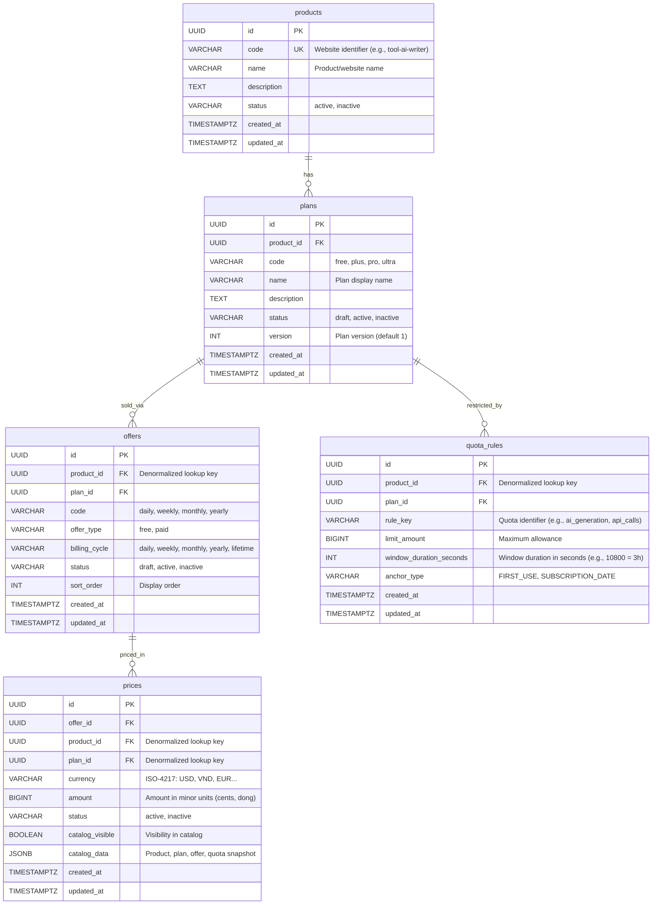

# Database Schema Specification: Product Catalog Service

## 1. TL;DR & Context

- **Goal:** Design the database schema (PostgreSQL) for the Product Catalog Service, strictly reflecting architectural decisions agreed upon in [specs/2026-10-06-product-catalog-service.md](file:///Users/tungle/Desktop/workspace/anthony-lewis/go-product/specs/2026-10-06-product-catalog-service.md).
- **Database Tech:** PostgreSQL 16+.
- **Migration Directory:** `./migrations/` (following `golang-migrate` standard: `000001_create_catalog_schema.up.sql` and `000001_create_catalog_schema.down.sql`).
- **Core Principles:**
  1. All primary keys (`id`) use `UUID` (preferably application-generated UUIDv7; DB-side defaults not required).
  2. Timestamps use `TIMESTAMPTZ NOT NULL DEFAULT now()`.
  3. Currencies store integer minor units (`BIGINT amount`, e.g., cents for USD, dong for VND) to ensure absolute precision when integrating with Payment Service.
  4. Clear separation of lifecycles between `plans` (immutable entitlements/quotas) and `offers` / `prices` (flexible across currencies and billing cycles).
  5. Every active plan must have at least one active offer and one active price. Free plans share the same structure as paid plans: `offer_type = 'free'`, `billing_cycle = 'lifetime'`, and `amount = 0`.
  6. `prices` also serves as a denormalized read model allowing Catalog API reads in a single query without joining source tables on the read path.
  7. All child tables maintain required ancestor IDs. Product Service is responsible for ensuring denormalized IDs point to a valid product-plan-offer tree.

---

## 2. Entity Relationship Diagram (ERD)



---

## 3. Schema Definitions

### 3.1. `products` Table
Represents an independent website or technical product group.

| Column Name | Data Type | Constraints | Description |
|---|---|---|---|
| `id` | `UUID` | `PRIMARY KEY` | Primary key (application-generated UUIDv7). |
| `code` | `VARCHAR(64)` | `NOT NULL UNIQUE` | Unique identifier (e.g., website passes configured `product_id` or code). |
| `name` | `VARCHAR(255)` | `NOT NULL` | Product name. |
| `description` | `TEXT` | `NULL` | Detailed description. |
| `status` | `VARCHAR(32)` | `NOT NULL DEFAULT 'active'` | Status: `active`, `inactive`. |
| `created_at` | `TIMESTAMPTZ` | `NOT NULL DEFAULT now()` | Creation timestamp. |
| `updated_at` | `TIMESTAMPTZ` | `NOT NULL DEFAULT now()` | Update timestamp. |

- **Indexes:**
  - `products_code_idx` (`UNIQUE (code)`)

---

### 3.2. `plans` Table
Represents entitlement tiers and quota policies.

| Column Name | Data Type | Constraints | Description |
|---|---|---|---|
| `id` | `UUID` | `PRIMARY KEY` | Primary key (application-generated UUIDv7). |
| `product_id` | `UUID` | `NOT NULL REFERENCES products(id) ON DELETE RESTRICT` | Associated product. |
| `code` | `VARCHAR(64)` | `NOT NULL` | Plan code (e.g., `free`, `pro`, `ultra`). |
| `name` | `VARCHAR(255)` | `NOT NULL` | Plan display name. |
| `description` | `TEXT` | `NULL` | Entitlement description. |
| `status` | `VARCHAR(32)` | `NOT NULL DEFAULT 'draft'` | `draft`, `active`, `inactive`. |
| `version` | `INT` | `NOT NULL DEFAULT 1` | Entitlement version number. |
| `created_at` | `TIMESTAMPTZ` | `NOT NULL DEFAULT now()` | Creation timestamp. |
| `updated_at` | `TIMESTAMPTZ` | `NOT NULL DEFAULT now()` | Update timestamp. |

- **Constraints:**
  - `UNIQUE (product_id, code, version)`: Each plan within a product has a unique code and version.
- **Indexes:**
  - `plans_product_id_status_idx`: Supports Catalog queries fetching active plans for a product.

---

### 3.3. `offers` Table
Represents commercial packaging options for a Plan (daily, weekly, monthly, yearly).

| Column Name | Data Type | Constraints | Description |
|---|---|---|---|
| `id` | `UUID` | `PRIMARY KEY` | Primary key (application-generated UUIDv7). |
| `product_id` | `UUID` | `NOT NULL REFERENCES products(id) ON DELETE RESTRICT` | Denormalized key to filter offers by product without joining plans. |
| `plan_id` | `UUID` | `NOT NULL REFERENCES plans(id) ON DELETE RESTRICT` | Associated plan. |
| `code` | `VARCHAR(64)` | `NOT NULL` | Offer code (e.g., `free`, `monthly`, `yearly`). |
| `offer_type` | `VARCHAR(32)` | `NOT NULL` | Offer type: `free` or `paid`. Used by clients to determine signup/checkout flow. |
| `billing_cycle` | `VARCHAR(32)` | `NOT NULL` | Billing cycle: `daily`, `weekly`, `monthly`, `yearly`, `lifetime`. |
| `status` | `VARCHAR(32)` | `NOT NULL DEFAULT 'draft'` | `draft`, `active`, `inactive`. |
| `sort_order` | `INT` | `NOT NULL DEFAULT 0` | UI display order. |
| `created_at` | `TIMESTAMPTZ` | `NOT NULL DEFAULT now()` | Creation timestamp. |
| `updated_at` | `TIMESTAMPTZ` | `NOT NULL DEFAULT now()` | Update timestamp. |

- **Business Conventions:**
  - `offer_type` accepts `free` or `paid`.
  - A `free` offer must have `billing_cycle = 'lifetime'`.
  - A `paid` offer uses one of `daily`, `weekly`, `monthly`, `yearly`, `lifetime`.
- **Constraints:**
  - `UNIQUE (plan_id, billing_cycle)`: Each plan has only 1 offer per billing cycle.
- **Rules on Plan Activation:**
  - Plan must have at least one active offer.
  - Each active offer must have at least one active price.
  - A `free` offer must have price `amount = 0` for each supported currency.
  - A `paid` offer must have price `amount > 0`.
  - These cross-table rules are enforced by Product Service in the same transaction when activating a plan.
- **Indexes:**
  - `offers_product_plan_status_idx` (`product_id`, `plan_id`, `status`): Supports querying offers by product-plan tree and status.

---

### 3.4. `prices` Table
Represents specific prices in designated currencies for each Offer.

| Column Name | Data Type | Constraints | Description |
|---|---|---|---|
| `id` | `UUID` | `PRIMARY KEY` | Primary key (application-generated UUIDv7). |
| `offer_id` | `UUID` | `NOT NULL REFERENCES offers(id) ON DELETE CASCADE` | Associated offer. |
| `product_id` | `UUID` | `NOT NULL REFERENCES products(id) ON DELETE RESTRICT` | Denormalized key to filter catalog by product without joins. |
| `plan_id` | `UUID` | `NOT NULL REFERENCES plans(id) ON DELETE RESTRICT` | Denormalized key to group results by plan without joins. |
| `currency` | `VARCHAR(3)` | `NOT NULL` | Uppercase ISO-4217 currency code (USD, VND, EUR). |
| `amount` | `BIGINT` | `NOT NULL` | Amount in minor units (VND = 100000, USD $10.00 = 1000). By convention, free offers use `0`; paid offers use values greater than `0`. |
| `status` | `VARCHAR(32)` | `NOT NULL DEFAULT 'active'` | `active`, `inactive`. |
| `catalog_visible` | `BOOLEAN` | `NOT NULL DEFAULT false` | Computed display status aggregated from product, plan, offer, and price. |
| `catalog_data` | `JSONB` | `NOT NULL` | Snapshot containing display data for product, plan, offer, and quota rules. |
| `created_at` | `TIMESTAMPTZ` | `NOT NULL DEFAULT now()` | Creation timestamp. |
| `updated_at` | `TIMESTAMPTZ` | `NOT NULL DEFAULT now()` | Update timestamp. |

- **Constraints:**
  - `UNIQUE (offer_id, currency)`: An offer has at most 1 price per currency.
- **Read Model Synchronization:**
  - Product Service updates `product_id`, `plan_id`, `catalog_visible`, and `catalog_data` in the same transaction as catalog changes.
  - When product, plan, offer, or quota changes, the service rebuilds affected price rows.
  - `catalog_data` is strictly for reading; `products`, `plans`, `offers`, and `quota_rules` tables remain the sources of truth.
- **Indexes:**
  - `UNIQUE (offer_id, currency)` provides the composite index for Payment lookups; no redundant index is created.
  - `prices_catalog_idx`: Supports Catalog API filtering visible prices by `product_id` + `currency`.

### 3.4.1. Catalog Query

```sql
SELECT id AS price_id,
       offer_id,
       plan_id,
       currency,
       amount,
       catalog_data
FROM prices
WHERE product_id = $1
  AND currency = $2
  AND status = 'active'
  AND catalog_visible = true;
```

---

### 3.5. `quota_rules` Table
Represents quota rate-limiting policies applied to a Plan.

| Column Name | Data Type | Constraints | Description |
|---|---|---|---|
| `id` | `UUID` | `PRIMARY KEY` | Primary key (application-generated UUIDv7). |
| `product_id` | `UUID` | `NOT NULL REFERENCES products(id) ON DELETE RESTRICT` | Denormalized key to filter quotas by product without joining plans. |
| `plan_id` | `UUID` | `NOT NULL REFERENCES plans(id) ON DELETE CASCADE` | Associated plan. |
| `rule_key` | `VARCHAR(64)` | `NOT NULL` | Limited resource key (e.g., `ai_tokens`, `generations`). |
| `limit_amount` | `BIGINT` | `NOT NULL` | Maximum allowance within window; by convention must be greater than `0`. |
| `window_duration_seconds` | `INT` | `NOT NULL` | Time window duration in seconds; by convention must be greater than `0`. |
| `anchor_type` | `VARCHAR(32)` | `NOT NULL` | Window anchor mechanism: `FIRST_USE` or `SUBSCRIPTION_DATE`. |
| `created_at` | `TIMESTAMPTZ` | `NOT NULL DEFAULT now()` | Creation timestamp. |
| `updated_at` | `TIMESTAMPTZ` | `NOT NULL DEFAULT now()` | Update timestamp. |

- **Business Conventions:**
  - `anchor_type` accepts `FIRST_USE` or `SUBSCRIPTION_DATE`.
  - `limit_amount` and `window_duration_seconds` must be greater than `0`.
- **Constraints:**
  - `UNIQUE (plan_id, rule_key, anchor_type)`
- **Indexes:**
  - `quota_rules_product_plan_idx` (`product_id`, `plan_id`): Supports Usage Service reading policies by product-plan tree.

---

## 4. Migration Plan (`./migrations`)

Using standard `golang-migrate` format:
- `migrations/000001_create_catalog_schema.up.sql`: Creates all 5 tables, foreign keys, unique constraints, and indexes. Value conventions are validated by Product Service upon writing.
- `migrations/000001_create_catalog_schema.down.sql`: Drops all tables in reverse dependency order (`DROP TABLE IF EXISTS quota_rules, prices, offers, plans, products;`).
