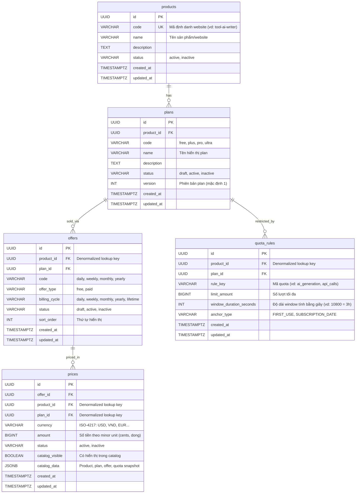

# Database Schema Specification: Product Catalog Service

## 1. TL;DR & Bối cảnh

- **Mục tiêu:** Thiết kế schema cơ sở dữ liệu (PostgreSQL) phục vụ dịch vụ Product Catalog Service, phản ánh đúng các quyết định kiến trúc đã thống nhất trong [specs/2026-10-06-product-catalog-service.md](file:///Users/tungle/Desktop/workspace/anthony-lewis/go-product/specs/2026-10-06-product-catalog-service.md).
- **Công nghệ DB:** PostgreSQL 16+.
- **Thư mục migration:** `./migrations/` (tuân thủ chuẩn `golang-migrate`: `000001_create_catalog_schema.up.sql` và `000001_create_catalog_schema.down.sql`).
- **Nguyên tắc cốt lõi:**
  1. Tất cả khóa chính (`id`) sử dụng kiểu `UUID` (ưu tiên UUIDv7 sinh từ ứng dụng; không bắt buộc DB-side default).
  2. Thời gian dùng `TIMESTAMPTZ NOT NULL DEFAULT now()`.
  3. Tiền tệ lưu số nguyên minor unit (`BIGINT amount`, ví dụ cents cho USD, đồng cho VND) để đảm bảo độ chính xác tuyệt đối khi tích hợp Payment Service.
  4. Tách biệt rõ ràng vòng đời của `plans` (bất biến về quyền lợi/quota) và `offers` / `prices` (linh hoạt theo tiền tệ và chu kỳ bán).
  5. Mọi plan active đều có ít nhất một offer active và một price active. Free plan dùng cùng cấu trúc với paid plan: `offer_type = 'free'`, `billing_cycle = 'lifetime'` và `amount = 0`.
  6. `prices` đồng thời chứa read model denormalized để Catalog API đọc bằng một query, không join các bảng nguồn trên read path.
  7. Mọi bảng con giữ các ancestor ID cần thiết. Product Service chịu trách nhiệm bảo đảm các ID denormalized cùng trỏ về một cây product-plan-offer hợp lệ.

---

## 2. Mô hình thực thể quan hệ (ERD)



---

## 3. Chi tiết định nghĩa bảng (Schema Definition)

### 3.1. Bảng `products`
Đại diện cho website hoặc nhóm sản phẩm kỹ thuật độc lập.

| Tên cột | Kiểu dữ liệu | Ràng buộc | Diễn giải |
|---|---|---|---|
| `id` | `UUID` | `PRIMARY KEY` | Khóa chính (UUIDv7 từ app). |
| `code` | `VARCHAR(64)` | `NOT NULL UNIQUE` | Mã duy nhất (ví dụ website gửi `product_id` hoặc mã cấu hình). |
| `name` | `VARCHAR(255)` | `NOT NULL` | Tên sản phẩm. |
| `description` | `TEXT` | `NULL` | Mô tả chi tiết. |
| `status` | `VARCHAR(32)` | `NOT NULL DEFAULT 'active'` | Trạng thái: `active`, `inactive`. |
| `created_at` | `TIMESTAMPTZ` | `NOT NULL DEFAULT now()` | Thời điểm tạo. |
| `updated_at` | `TIMESTAMPTZ` | `NOT NULL DEFAULT now()` | Thời điểm cập nhật. |

- **Index:**
  - `products_code_idx` (`UNIQUE (code)`)

---

### 3.2. Bảng `plans`
Đại diện cho cấp bậc quyền lợi (entitlement) và chính sách quota.

| Tên cột | Kiểu dữ liệu | Ràng buộc | Diễn giải |
|---|---|---|---|
| `id` | `UUID` | `PRIMARY KEY` | Khóa chính (UUIDv7 từ app). |
| `product_id` | `UUID` | `NOT NULL REFERENCES products(id) ON DELETE RESTRICT` | Thuộc sản phẩm nào. |
| `code` | `VARCHAR(64)` | `NOT NULL` | Mã plan (ví dụ `free`, `pro`, `ultra`). |
| `name` | `VARCHAR(255)` | `NOT NULL` | Tên hiển thị của plan. |
| `description` | `TEXT` | `NULL` | Mô tả quyền lợi. |
| `status` | `VARCHAR(32)` | `NOT NULL DEFAULT 'draft'` | `draft`, `active`, `inactive`. |
| `version` | `INT` | `NOT NULL DEFAULT 1` | Số phiên bản quyền lợi. |
| `created_at` | `TIMESTAMPTZ` | `NOT NULL DEFAULT now()` | Thời điểm tạo. |
| `updated_at` | `TIMESTAMPTZ` | `NOT NULL DEFAULT now()` | Thời điểm cập nhật. |

- **Ràng buộc:**
  - `UNIQUE (product_id, code, version)`: Mỗi plan trong 1 product có mã và version duy nhất.
- **Index:**
  - `plans_product_id_status_idx`: Phục vụ query Catalog lấy danh sách plan active của một product.

---

### 3.3. Bảng `offers`
Đại diện cho hình thức đóng gói bán hàng của một Plan (theo ngày, tuần, tháng, năm).

| Tên cột | Kiểu dữ liệu | Ràng buộc | Diễn giải |
|---|---|---|---|
| `id` | `UUID` | `PRIMARY KEY` | Khóa chính (UUIDv7 từ app). |
| `product_id` | `UUID` | `NOT NULL REFERENCES products(id) ON DELETE RESTRICT` | Khóa denormalized để lọc offer theo product mà không join plan. |
| `plan_id` | `UUID` | `NOT NULL REFERENCES plans(id) ON DELETE RESTRICT` | Thuộc plan nào. |
| `code` | `VARCHAR(64)` | `NOT NULL` | Mã offer (vd `free`, `monthly`, `yearly`). |
| `offer_type` | `VARCHAR(32)` | `NOT NULL` | Loại offer: `free` hoặc `paid`. Client dùng trường này để chọn luồng đăng ký. |
| `billing_cycle` | `VARCHAR(32)` | `NOT NULL` | Chu kỳ tính cước: `daily`, `weekly`, `monthly`, `yearly`, `lifetime`. |
| `status` | `VARCHAR(32)` | `NOT NULL DEFAULT 'draft'` | `draft`, `active`, `inactive`. |
| `sort_order` | `INT` | `NOT NULL DEFAULT 0` | Thứ tự hiển thị UI. |
| `created_at` | `TIMESTAMPTZ` | `NOT NULL DEFAULT now()` | Thời điểm tạo. |
| `updated_at` | `TIMESTAMPTZ` | `NOT NULL DEFAULT now()` | Thời điểm cập nhật. |

- **Quy ước nghiệp vụ:**
  - `offer_type` nhận giá trị `free` hoặc `paid`.
  - Offer `free` bắt buộc có `billing_cycle = 'lifetime'`.
  - Offer `paid` dùng một trong các chu kỳ `daily`, `weekly`, `monthly`, `yearly`, `lifetime`.
- **Ràng buộc:**
  - `UNIQUE (plan_id, billing_cycle)`: Mỗi plan chỉ có 1 offer cho 1 chu kỳ bán.
- **Quy tắc khi activate plan:**
  - Plan phải có ít nhất một offer active.
  - Mỗi offer active phải có ít nhất một price active.
  - Offer `free` phải có price `amount = 0` cho từng currency được hỗ trợ.
  - Offer `paid` phải có price `amount > 0`.
  - Các quy tắc liên bảng này được Product Service kiểm tra trong cùng transaction khi activate plan.
- **Index:**
  - `offers_product_plan_status_idx` (`product_id`, `plan_id`, `status`): Phục vụ query offer theo cây product-plan và trạng thái.

---

### 3.4. Bảng `prices`
Đại diện cho giá bán cụ thể theo đơn vị tiền tệ cho từng Offer.

| Tên cột | Kiểu dữ liệu | Ràng buộc | Diễn giải |
|---|---|---|---|
| `id` | `UUID` | `PRIMARY KEY` | Khóa chính (UUIDv7 từ app). |
| `offer_id` | `UUID` | `NOT NULL REFERENCES offers(id) ON DELETE CASCADE` | Thuộc offer nào. |
| `product_id` | `UUID` | `NOT NULL REFERENCES products(id) ON DELETE RESTRICT` | Khóa denormalized để lọc catalog theo product mà không join. |
| `plan_id` | `UUID` | `NOT NULL REFERENCES plans(id) ON DELETE RESTRICT` | Khóa denormalized để nhóm kết quả theo plan mà không join. |
| `currency` | `VARCHAR(3)` | `NOT NULL` | Mã tiền tệ ISO-4217 viết hoa (USD, VND, EUR). |
| `amount` | `BIGINT` | `NOT NULL` | Giá tính bằng minor unit (VND = 100000, USD $10.00 = 1000). Theo quy ước, free offer dùng `0`; paid offer dùng giá trị lớn hơn `0`. |
| `status` | `VARCHAR(32)` | `NOT NULL DEFAULT 'active'` | `active`, `inactive`. |
| `catalog_visible` | `BOOLEAN` | `NOT NULL DEFAULT false` | Trạng thái hiển thị đã tổng hợp từ product, plan, offer và price. |
| `catalog_data` | `JSONB` | `NOT NULL` | Snapshot chứa dữ liệu hiển thị của product, plan, offer và quota rules. |
| `created_at` | `TIMESTAMPTZ` | `NOT NULL DEFAULT now()` | Thời điểm tạo. |
| `updated_at` | `TIMESTAMPTZ` | `NOT NULL DEFAULT now()` | Thời điểm cập nhật. |

- **Ràng buộc:**
  - `UNIQUE (offer_id, currency)`: Một offer chỉ có 1 mức giá cho 1 loại tiền tệ.
- **Đồng bộ read model:**
  - Product Service cập nhật `product_id`, `plan_id`, `catalog_visible` và `catalog_data` trong cùng transaction với thay đổi catalog.
  - Khi product, plan, offer hoặc quota thay đổi, service rebuild các price row bị ảnh hưởng.
  - `catalog_data` chỉ phục vụ đọc; các bảng `products`, `plans`, `offers` và `quota_rules` vẫn là source of truth.
- **Index:**
  - `UNIQUE (offer_id, currency)` đã cung cấp composite index cho Payment lookup; không tạo index trùng lặp.
  - `prices_catalog_idx`: Phục vụ Catalog API lọc price đang hiển thị theo `product_id` + `currency`.

### 3.4.1. Catalog query

```sql
SELECT id AS price_id,
       offer_id,
       plan_id,
       currency,
       amount,
       catalog_data
FROM prices
WHERE product_id = $1
  AND currency = $2
  AND status = 'active'
  AND catalog_visible = true;
```

---

### 3.5. Bảng `quota_rules`
Đại diện cho chính sách giới hạn quota áp dụng cho Plan.

| Tên cột | Kiểu dữ liệu | Ràng buộc | Diễn giải |
|---|---|---|---|
| `id` | `UUID` | `PRIMARY KEY` | Khóa chính (UUIDv7 từ app). |
| `product_id` | `UUID` | `NOT NULL REFERENCES products(id) ON DELETE RESTRICT` | Khóa denormalized để lọc quota theo product mà không join plan. |
| `plan_id` | `UUID` | `NOT NULL REFERENCES plans(id) ON DELETE CASCADE` | Thuộc plan nào. |
| `rule_key` | `VARCHAR(64)` | `NOT NULL` | Loại tài nguyên bị giới hạn (vd `ai_tokens`, `generations`). |
| `limit_amount` | `BIGINT` | `NOT NULL` | Số lượng tối đa trong window; theo quy ước phải lớn hơn `0`. |
| `window_duration_seconds` | `INT` | `NOT NULL` | Độ dài cửa sổ thời gian; theo quy ước phải lớn hơn `0`. |
| `anchor_type` | `VARCHAR(32)` | `NOT NULL` | Cơ chế xác định mốc window: `FIRST_USE` hoặc `SUBSCRIPTION_DATE`. |
| `created_at` | `TIMESTAMPTZ` | `NOT NULL DEFAULT now()` | Thời điểm tạo. |
| `updated_at` | `TIMESTAMPTZ` | `NOT NULL DEFAULT now()` | Thời điểm cập nhật. |

- **Quy ước nghiệp vụ:**
  - `anchor_type` nhận giá trị `FIRST_USE` hoặc `SUBSCRIPTION_DATE`.
  - `limit_amount` và `window_duration_seconds` phải lớn hơn `0`.
- **Ràng buộc:**
  - `UNIQUE (plan_id, rule_key, anchor_type)`
- **Index:**
  - `quota_rules_product_plan_idx` (`product_id`, `plan_id`): Phục vụ Usage Service đọc policy theo cây product-plan.

---

## 4. Kế hoạch Migration (`./migrations`)

Sử dụng định dạng tiêu chuẩn của `golang-migrate`:
- `migrations/000001_create_catalog_schema.up.sql`: Tạo toàn bộ 5 bảng, foreign keys, unique constraints và indexes. Các quy ước giá trị được Product Service kiểm tra khi ghi.
- `migrations/000001_create_catalog_schema.down.sql`: Drop toàn bộ bảng theo thứ tự quan hệ ngược lại (`DROP TABLE IF EXISTS quota_rules, prices, offers, plans, products;`).
