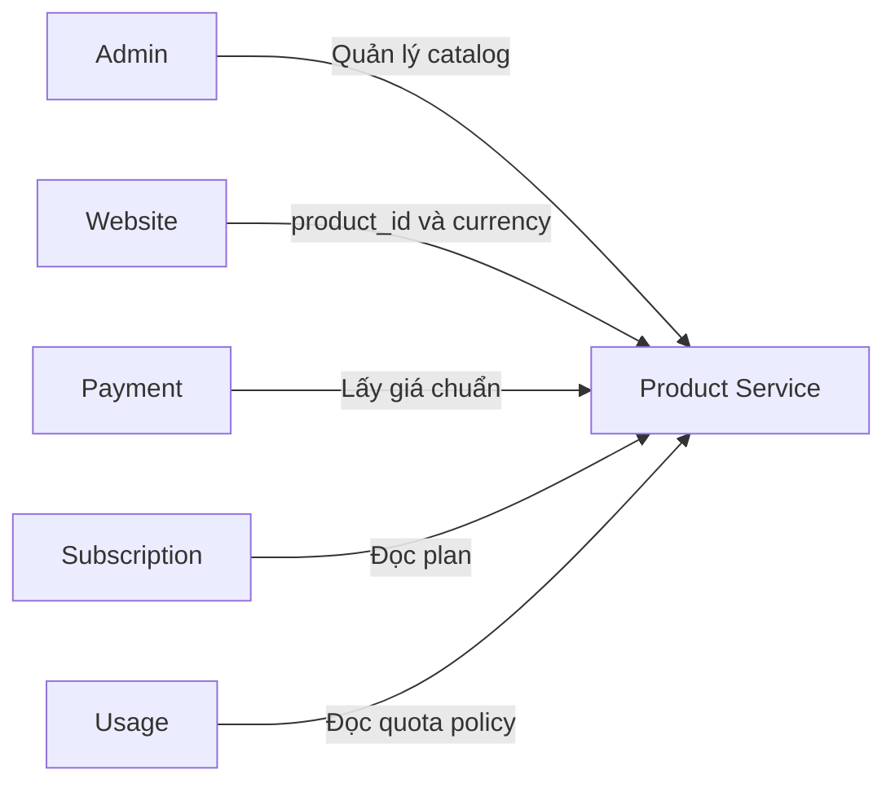
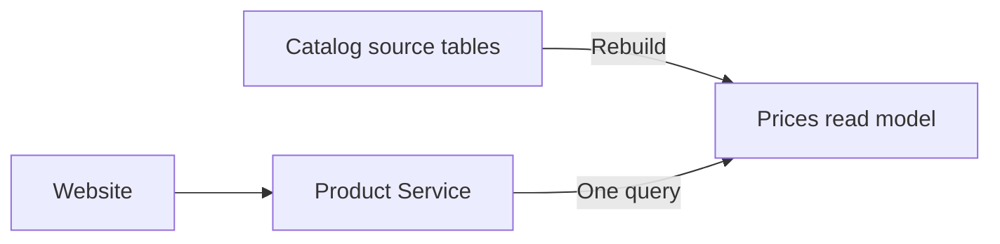
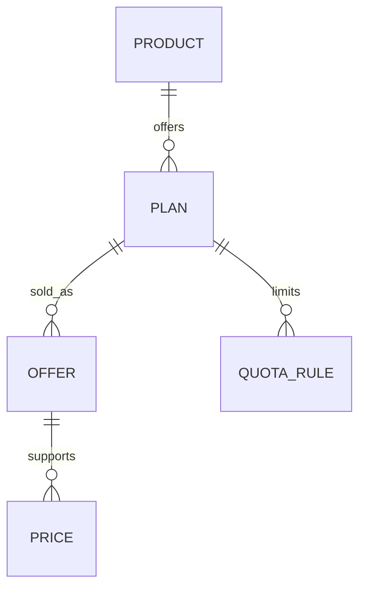
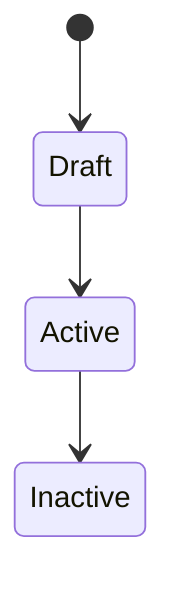

# Product Catalog Service

## TL;DR

- **Goal:** Cung cấp nguồn dữ liệu chuẩn về sản phẩm, plan, giá và chính sách quota cho nhiều website.
- **Quyết định chính:** Mỗi website cấu hình một `product_id`; định nghĩa quyền lợi và quota của plan đã active là bất biến; mọi plan dùng chung cấu trúc offer và price; offer và price có vòng đời thương mại riêng.
- **Tác động:** Website đọc catalog, Payment xác thực giá, còn Subscription và Usage áp dụng quyền sử dụng và quota.

## Ranh giới hệ thống

Product Service không suy ra product từ domain. Việc ánh xạ website với `product_id` nằm trong cấu hình của từng website.

Catalog read path dùng read model denormalized trong `prices`. Các bảng product, plan, offer và quota vẫn là source of truth.
Các bảng con giữ ancestor ID (`product_id`, `plan_id`, `offer_id`) cần cho read path để tránh join chỉ nhằm truy ngược quan hệ.

## Mô hình dữ liệu nghiệp vụ

- **Product:** Sản phẩm tương ứng với một website tại thời điểm hiện tại.
- **Plan:** Cấp quyền lợi như free, plus, pro hoặc ultra.
- **Offer:** Cách một plan được cung cấp. `offer_type` là `free` hoặc `paid`. Free offer dùng chu kỳ `lifetime`; paid offer dùng daily, weekly, monthly, yearly hoặc lifetime.
- **Price:** Giá được cấu hình riêng cho từng offer và currency; không tự quy đổi ngoại tệ.
- **Quota rule:** Một giới hạn gồm số lượt, độ dài window và mốc bắt đầu window với enum tường minh `anchor_type` (`FIRST_USE` hoặc `SUBSCRIPTION_DATE`).

## Giao tiếp bên ngoài

- **Website catalog:** Gửi `product_id` và currency. Product Service đọc các price row đang hiển thị bằng một query; `catalog_data` chứa plan, offer và quota. Free và paid có cùng response shape.
- **Payment lookup:** Gửi `offer_id` và currency để lấy số tiền chuẩn. Payment không tin giá do client gửi lên.
- **Subscription lookup:** Đọc plan bằng ID để cấp entitlement sau khi mua hoặc đăng ký free.
- **Usage lookup:** Đọc toàn bộ quota rule của plan để cấu hình bộ đếm sử dụng.
- **Admin management:** Tạo product, plan, offer, price và quota; quản lý trạng thái active/inactive của plan và offer.

## Vòng đời plan và offer

- **Plan (Quyền lợi & Quota):**
  - **Draft:** Có thể sửa định nghĩa quyền lợi và quota; chưa được bán.
  - **Active:** Bất biến về quyền lợi và quota để bảo vệ tính nhất quán của entitlement.
  - **Inactive:** Không hiển thị cho khách mới nhưng vẫn đọc được nội bộ bằng ID để phục vụ các entitlement đã cấp.
  - **Thay đổi quyền lợi/quota:** Deactivate plan cũ và tạo plan mới.
- **Offer & Price (Thương mại):**
  - Quản lý hình thức bán (daily, monthly...) và giá theo currency độc lập với Plan ID.
  - Có thể active/inactive hoặc bổ sung giá currency mới cho offer mà không cần tạo plan mới.
  - Lịch sử giá giao dịch được lưu tại Payment Service; thay đổi giá niêm yết không ảnh hưởng entitlement hiện tại.

## Quy tắc quota

- **Chống quá tải (`anchor_type: FIRST_USE`):** Ví dụ `1.000 lượt / 3 giờ`; window bắt đầu ở lần dùng đầu tiên. Usage Service thực thi bằng Redis TTL.
- **Giới hạn chi phí (`anchor_type: SUBSCRIPTION_DATE`):** Ví dụ `5.000 lượt / tháng`; window bám theo ngày bắt đầu subscription.
- **Không theo dõi sử dụng:** Product Service chỉ lưu policy và `anchor_type`, không lưu counter, TTL hoặc thời điểm reset thực tế.

## Scope

### In scope

| Hạng mục | Mức sẵn sàng | Cơ sở / hành động |
|---|---|---|
| Catalog theo `product_id` | **Ready** | Website truyền ID đã cấu hình. |
| Giá đa tiền tệ | **Ready** | Mỗi currency có giá cấu hình riêng. |
| Nhiều quota rule | **Ready** | Hỗ trợ window theo lần dùng đầu và ngày mua. |
| Free plan | **Ready** | Có offer `free`, chu kỳ `lifetime` và price `amount = 0`; không qua Payment và cấp entitlement không hết hạn. |
| Plan thay thế | **Ready** | Khi thay đổi quyền lợi/quota, plan cũ chuyển inactive tiếp tục phục vụ entitlement hiện tại; thay đổi giá/offer không cần tạo plan mới. |
| Khả dụng theo currency | **Ready** | Offer độc lập khả dụng theo từng currency có giá; không ép đủ toàn bộ currency ở cấp product. |

### Out of scope

- Customer, order, payment transaction và subscription của từng khách.
- Usage counter, Redis TTL và nghiệp vụ reset quota.
- Category hoặc product group.
- Tự động quy đổi currency.
- Suy ra product từ website domain.

## Hành vi

- **Xem catalog:** Trả về các plan active và các offer có cấu hình giá khả dụng cho currency được yêu cầu; ẩn các offer thiếu giá currency đó. Free và paid offer có cùng cấu trúc dữ liệu.
- **Tạo thanh toán:** Payment dùng `offer_id` và currency để lấy giá chuẩn; trả về lỗi (not found / unavailable) nếu offer chưa có giá cho currency yêu cầu. Payment tự lưu giá tại thời điểm thanh toán.
- **Đăng ký free:** Client gửi `offer_id` như paid flow. Backend nhận biết `offer_type = 'free'`, xác thực `amount = 0`, bỏ qua Payment và tạo entitlement.
- **Kích hoạt plan:** Chỉ cho phép active khi plan có offer active và mỗi offer active có price active. Free offer phải có chu kỳ `lifetime` và giá `0`; paid offer phải có giá lớn hơn `0`.
- **Đồng bộ catalog:** Mọi thay đổi product, plan, offer, price hoặc quota phải cập nhật read model trong các price row liên quan trong cùng transaction.
- **Đồng bộ ID:** Khi ghi offer, price hoặc quota, Product Service phải xác thực các ancestor ID thuộc cùng một cây product-plan-offer và ghi chúng trong cùng transaction.
- **Plan bị inactive:** Không xuất hiện trong catalog công khai nhưng còn truy vấn được nội bộ cho entitlement đang tồn tại.
- **Dữ liệu bất biến:** Không sửa quyền lợi hoặc quota của plan active; thay đổi quyền lợi thì tạo plan mới. Offer và price có thể cập nhật hoặc thay thế mà không làm đổi Plan ID.

## Quyết định còn mở

- Plan như plus, pro và ultra là danh sách cố định hay tên do từng product tự định nghĩa.
- Mỗi paid plan bắt buộc có đủ bốn duration hay được chọn một tập duration.
- API dùng REST/JSON hay giao thức khác.
- Website catalog là public hay yêu cầu API credential.
