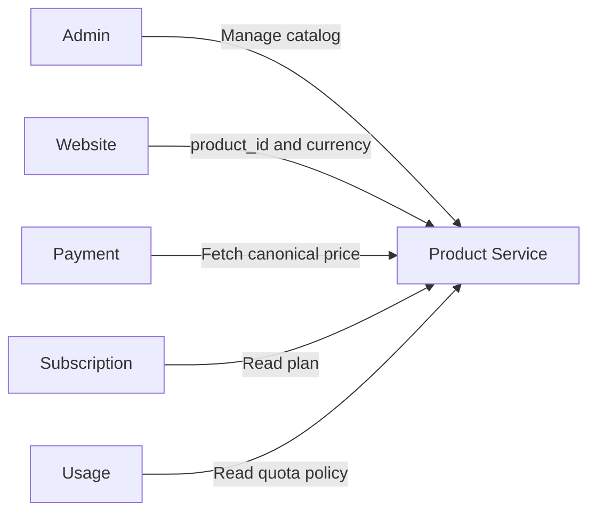
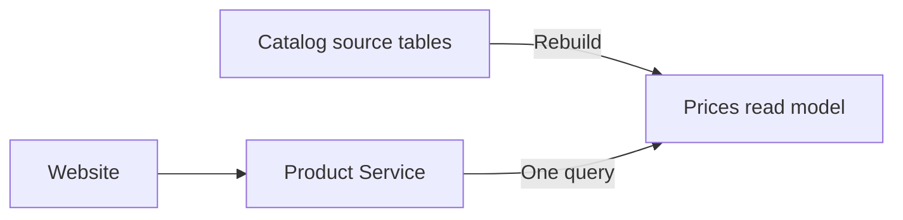
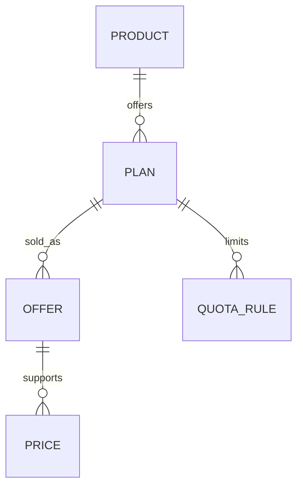
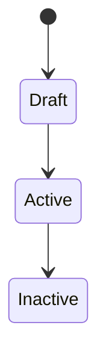

# Product Catalog Service

## TL;DR

- **Goal:** Provide a canonical data source for products, plans, prices, and quota policies across multiple websites.
- **Key Decisions:** Each website configures a `product_id`; plan entitlements and quota definitions are immutable once active; all plans share a unified offer and price structure; offers and prices have their own commercial lifecycles.
- **Impact:** Websites read the catalog, Payment verifies prices, while Subscription and Usage enforce entitlements and quotas.

## System Boundaries

Product Service does not infer products from domains. The mapping of websites to `product_id` resides in each website's configuration.

The catalog read path uses a denormalized read model in `prices`. The product, plan, offer, and quota tables remain the sources of truth.
Child tables maintain ancestor IDs (`product_id`, `plan_id`, `offer_id`) needed by the read path to avoid joins solely for reverse relationship traversal.

## Domain Data Model

- **Product:** A product corresponding to a website at the current point in time.
- **Plan:** An entitlement tier such as free, plus, pro, or ultra.
- **Offer:** How a plan is packaged and sold. `offer_type` is `free` or `paid`. Free offers use the `lifetime` billing cycle; paid offers use daily, weekly, monthly, yearly, or lifetime.
- **Price:** Price configured independently per offer and currency; no automatic foreign currency conversion.
- **Quota rule:** A limit consisting of a count limit, window duration, and window start anchor with an explicit enum `anchor_type` (`FIRST_USE` or `SUBSCRIPTION_DATE`).

## External Interactions

- **Website catalog:** Sends `product_id` and currency. Product Service reads visible price rows in a single query; `catalog_data` contains plan, offer, and quota. Free and paid share the same response shape.
- **Payment lookup:** Sends `offer_id` and currency to fetch the canonical amount. Payment does not trust client-supplied prices.
- **Subscription lookup:** Reads plan by ID to grant entitlements after purchase or free registration.
- **Usage lookup:** Reads all quota rules for a plan to configure usage counters.
- **Admin management:** Creates products, plans, offers, prices, and quotas; manages active/inactive states of plans and offers.

## Plan and Offer Lifecycles

- **Plan (Entitlements & Quotas):**
  - **Draft:** Entitlements and quotas can be edited; not available for sale.
  - **Active:** Entitlements and quotas are immutable to protect entitlement integrity.
  - **Inactive:** Hidden from new customers but still readable internally by ID to service existing entitlements.
  - **Changing entitlements/quotas:** Deactivate old plan and create a new plan.
- **Offer & Price (Commercial):**
  - Manages packaging (daily, monthly...) and pricing by currency independently of Plan ID.
  - Can activate/deactivate or add new currency prices for an offer without creating a new plan.
  - Transaction price history is retained in Payment Service; changing catalog prices does not affect existing entitlements.

## Quota Rules

- **Rate-limiting / Anti-abuse (`anchor_type: FIRST_USE`):** E.g., `1,000 requests / 3 hours`; window starts on first use. Usage Service enforces via Redis TTL.
- **Cost capping (`anchor_type: SUBSCRIPTION_DATE`):** E.g., `5,000 requests / month`; window aligns with subscription start date.
- **No usage tracking:** Product Service only stores policy and `anchor_type`, not counters, TTLs, or actual reset timestamps.

## Scope

### In scope

| Item | Readiness | Rationale / Action |
|---|---|---|
| Catalog by `product_id` | **Ready** | Website passes configured ID. |
| Multi-currency pricing | **Ready** | Each currency has an explicitly configured price. |
| Multiple quota rules | **Ready** | Supports windows anchored by first use and purchase date. |
| Free plan | **Ready** | Has `free` offer, `lifetime` cycle, and price `amount = 0`; bypasses Payment and grants non-expiring entitlement. |
| Plan replacement | **Ready** | When modifying entitlements/quotas, old plan becomes inactive and continues servicing existing entitlements; changing prices/offers does not require a new plan. |
| Currency-based availability | **Ready** | Offers are independently available per priced currency; does not mandate full currency coverage at product level. |

### Out of scope

- Customers, orders, payment transactions, and individual customer subscriptions.
- Usage counters, Redis TTLs, and quota reset logic.
- Categories or product groups.
- Automatic currency conversion.
- Inferring product from website domain.

## Behaviors

- **Browsing catalog:** Returns active plans and offers with available price configurations for the requested currency; hides offers missing a price for that currency. Free and paid offers share the same data structure.
- **Creating payment:** Payment uses `offer_id` and currency to fetch the canonical price; returns an error (not found / unavailable) if the offer lacks a price for the requested currency. Payment stores the price at checkout time.
- **Free registration:** Client sends `offer_id` just like the paid flow. Backend detects `offer_type = 'free'`, verifies `amount = 0`, bypasses Payment, and creates the entitlement.
- **Activating plan:** Only permitted when the plan has active offers and each active offer has an active price. Free offers must have `lifetime` cycle and price `0`; paid offers must have price greater than `0`.
- **Syncing catalog:** Any changes to product, plan, offer, price, or quota must update the read model in affected price rows within the same transaction.
- **Syncing IDs:** When writing offer, price, or quota, Product Service must validate ancestor IDs belong to the same product-plan-offer tree and persist them in the same transaction.
- **Inactive plan:** Hidden from public catalog but still queryable internally for existing entitlements.
- **Data immutability:** Do not edit entitlements or quotas of an active plan; create a new plan to change entitlements. Offers and prices can be updated or replaced without changing the Plan ID.

## Open Decisions

- Whether plans like plus, pro, and ultra are a fixed list or custom names defined per product.
- Whether each paid plan must have all four durations or can select a subset of durations.
- Whether the API uses REST/JSON or another protocol.
- Whether the website catalog is public or requires API credentials.
